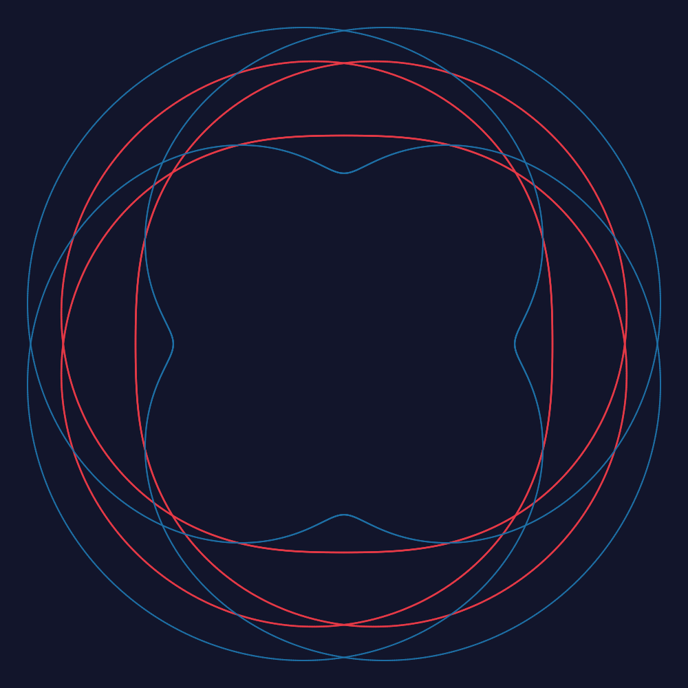
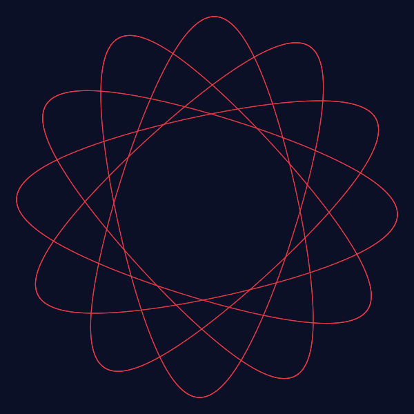
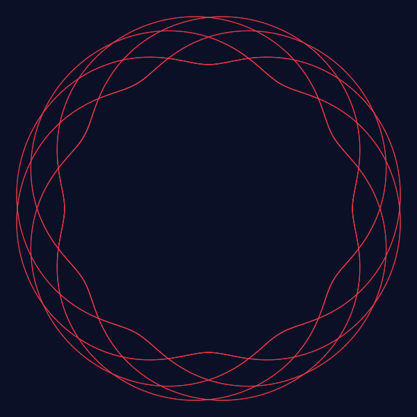
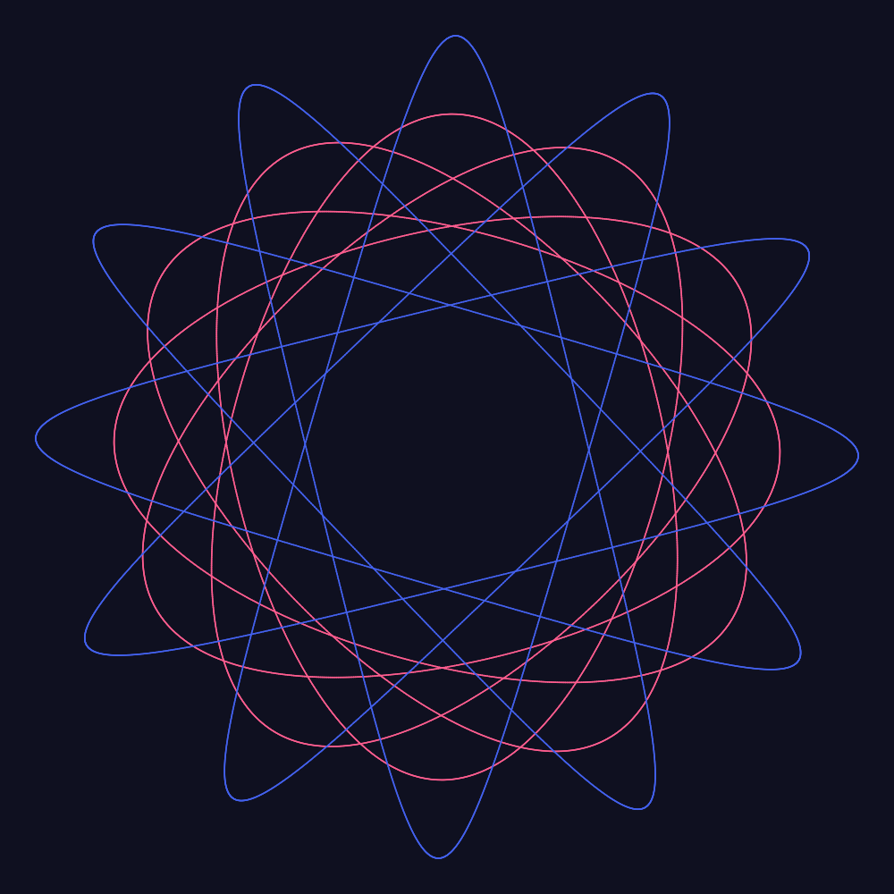
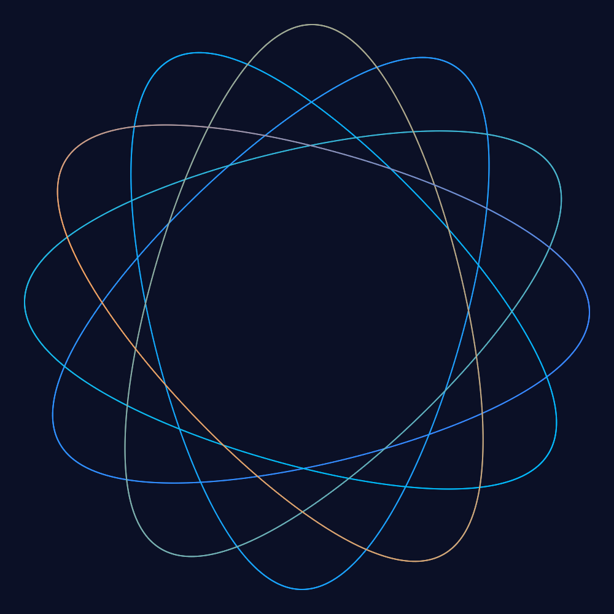

<p align="center">
  
</p>

<h1 align="center">Spirograph Generator</h1>

<p align="center">
  A browser-ready spirograph pattern generator <strong>demo UI</strong> + a <strong>cross-platform rendering library</strong>, shipped as an npm-workspaces monorepo.
  <br/>
  Generate mathematically exact <strong>hypotrochoids &amp; epitrochoids</strong>, animate them with rolling gears, and export high-resolution <strong>PNG / SVG</strong> — from the web, from React/Svelte, or straight from the CLI.
</p>

<p align="center">
  <a href="https://www.npmjs.com/package/@spirograph/core"></a>
  <a href="https://www.npmjs.com/package/@spirograph/react"></a>
  <a href="https://www.npmjs.com/package/@spirograph/svelte"></a>
  <a href="https://www.npmjs.com/package/@spirograph/cli"></a>
  
  
</p>

---

## Table of contents

- [What it is](#what-it-is)
- [Features](#features)
- [Monorepo layout](#monorepo-layout)
- [Quick start](#quick-start)
- [Web demo & URL parameters](#web-demo--url-parameters)
- [Using the library (`@spirograph/core`)](#using-the-library-spirographcore)
- [React components (`@spirograph/react`)](#react-components-spirographreact)
- [Svelte components (`@spirograph/svelte`)](#svelte-components-spirographsvelte)
- [CLI (`@spirograph/cli`)](#cli-spirographcli)
- [Image endpoint](#image-endpoint)
- [Deployment](#deployment)
- [The math](#the-math)
- [Development](#development)
- [Contributing & license](#contributing--license)

---

## What it is

A classic **spirograph** simulator: two gears mesh with a common tooth module — a fixed outer **ring gear** and a smaller **rolling gear** whose pen-hole traces a curve as it rolls. Depending on whether the rolling gear runs *inside* or *outside* the ring, you get a **hypotrochoid** or an **epitrochoid**, and the tooth counts determine how many lobes (petals) the finished figure has and when the loop closes.

Everything is computed from pure math in a shared core, so the **exact same pattern** renders identically on the `<canvas>` in your browser, inside a **React** or **Svelte** component, as a generated **SVG/PNG** file, or through the **CLI** — with per-segment gradient colors resolved in one place to keep them consistent everywhere.

| Inside (hypotrochoid) | Outside (epitrochoid) |
|:---:|:---:|
|  |  |

---

## Features

- **Gear specs** — ring gear 40–240 teeth, rolling gear 8–96 teeth (with classic quick values), *inside* / *outside* modes.
- **Multi-pen stacking** — any number of pens; each independently configured with hole (`0–100%` of rolling radius), color, and width (`0.5–8px`).
- **Two scale modes**:
  - *Fixed image size* — the pattern always fills the canvas.
  - *Fixed ring size* — the gear ring keeps a constant on-screen size and the pattern is drawn at true scale inside (hole changes don't shift other pens).
- **Simulated drawing animation** — the pen tip draws segment by segment; speed `0.1–10×`, pausable/resumable, with an optional visible gear.
- **Export** — high-resolution PNG (`2048px`) and SVG.
- **Presets & random** — 7 classic gear combinations in one click, plus a random-inspiration button.
- **URL sharing** — every parameter travels through the querystring; copy the address bar to share the current pattern.

<div align="center">

| Multi-pen stacking | Gradient colors |
|:---:|:---:|
|  |  |

</div>

The React/Svelte libraries expose the same feature set as controllable, embeddable components.

## Monorepo layout

The repo uses **npm workspaces** — the demo UI lives at the root, and each library is an independently publishable package:

```
packages/core/    @spirograph/core    Pure core: math / geometry / gradients / segment render
                                      contract / SVG / PNG — ZERO DOM or Node dependencies
packages/anim/    @spirograph/anim    Optional animation driver (injectable frame scheduler)
packages/canvas/  @spirograph/canvas  Browser-only Canvas 2D glue (renderer + export)
packages/react/   @spirograph/react   React: <SpirographCanvas> (render-only) + <SpirographAnimated>
packages/svelte/  @spirograph/svelte  Svelte 5: <SpirographCanvas> + <SpirographAnimated>
apps/cli/         @spirograph/cli     CLI: query / JSON → PNG / SVG files (bin: `spirograph`)

src/  api/  functions/                Web apps (root Vite multi-page): vanilla demo (index.html)
                                      + framework demo pages (svelte.html, react.html) + Vercel /
                                      Cloudflare deployment config
```

Every renderer is a thin adapter over `@spirograph/core`, so **any bug fix or new feature in the math is automatically shared** across Canvas, React, Svelte, SVG, PNG, the image endpoint, and the CLI.

## Quick start

```bash
npm install
npm run dev        # dev server http://localhost:5173
                   #   vanilla demo at /      React demo at /react.html
                   #   Svelte demo at /svelte.html
npm test           # build packages + Vitest unit tests (79 tests)
npm run build      # build packages + typecheck + production multi-page build → dist/
npm run check:purity  # guards the core library against platform dependencies
npm run build:cli  # build the CLI
```

That's it — no backend required to run the demo. The **image endpoint** uses a small Vite middleware in dev, and optional serverless functions in production (see [Deployment](#deployment)).

## Web demo & URL parameters

The vanilla demo (`/`) is a full editor: gear specs, per-pen controls, scale mode, animation speed, background color, presets, and export/download, all live-linked to the URL.

```
?ring=144&rolling=60&mode=inside&pen=40,1.8,3a86ff&pen=70,1.5,10,00bbf9,f4a261&bg=1b1b2f&speed=2.5&scale=fixed
```

| Param | Meaning | Range |
|---|---|---|
| `ring` | ring gear teeth | 40–240 |
| `rolling` | rolling gear teeth | 8–96 |
| `mode` | drawing mode | `inside` / `outside` |
| `pen` | one pen (repeatable): <br>`hole,width,color1` = solid; <br>`hole,width,spacing,color1[,color2[,color3[,color4]]]` = multi-color gradient | hole `0–100` / width `0.5–8` / spacing `1–100` |
| `bg` | background color | 6-digit hex (no `#`) |
| `speed` | animation speed | `0.1–10` |
| `scale` | scale mode | `auto` / `fixed` |
| `gears` | show the gear animation | `1` / `0` |

**Gradient pens**: `1 color = solid`, `≥ 2 colors = gradient`. The `spacing` parameter (a percentage) sets how far along the curve each color point sits before the set cycles — with ≥2 colors the pen fades smoothly between them around the closed loop.

Invalid parameters are silently ignored and fall back to defaults; when `inside` mode has rolling teeth ≥ ring teeth it is clamped automatically.

## Using the library (`@spirograph/core`)

The core is **framework- and platform-agnostic** (browser, Node, React Native/Hermes, or serverless — zero DOM / Node dependencies, guarded by `npm run check:purity`). There are two entry points:

- `.` (default) — pure logic: math, geometry, gradients, the segment render contract, and SVG/PNG generation.
- `./browser` — Canvas 2D rendering (a minimal structural interface, no DOM-lib dependency).

```ts
import { parseState, buildItems, buildSvg, generatePng, DEFAULT_STATE } from '@spirograph/core';

const state = parseState('?ring=72&rolling=30&pen=40,e63946,2.5');
const items = buildItems({ ...DEFAULT_STATE, ...state }); // merge parsed params over defaults
const svg   = buildSvg(items, '#ffffff', 1024);           // SVG string
const png   = generatePng('?ring=72&rolling=30&pen=40,e63946,2.5'); // PNG bytes

// Browser Canvas rendering (./browser subpath)
import { renderFull, clearCanvas } from '@spirograph/core/browser';
const ctx = clearCanvas(canvas, 800, 800, '#ffffff', window.devicePixelRatio || 1);
renderFull(ctx, items, computeTransform(computeBounds(items.map(i => i.curve)), 800, 800, 32));
```

Notable design points:

- **Unified colors** — gradient colors are resolved centrally in `buildRenderData` (per-segment), so Canvas, SVG, and PNG make identical color decisions. `parseColor` accepts both hex and `rgb(...)` forms for rasterization.
- **Retargetable render contract** — `RenderData` (segment-level data) plus `createFramePlan` (frame plan) and `generatePng` / `generateSvg` serializers are the consumed contracts, so a new backend only has to consume `RenderData`.
- **No URL API needed** — URL encode/decode is a built-in pure string codec (no dependency on `URLSearchParams` / `TextEncoder`).

## React components (`@spirograph/react`)

Install: `npm i @spirograph/react`

Two components on top of the core:
- `<SpirographCanvas>` — render-only: draw any pattern synchronously.
- `<SpirographAnimated>` — controllable animation with play/pause/resume and speed.

```tsx
import { SpirographAnimated } from '@spirograph/react';

<SpirographAnimated
  state={{ ringTeeth: 144, rollingTeeth: 60, pens: [{ hole: 40, color: '#e63946', width: 2.5 }] }}
  speed={2}
  className="w-full h-64"
/>
```

Both accept a `SpirographState`/params object, expose imperative handles (`SpirographHandle` / `SpirographAnimationHandle`), and render to a `<canvas>` filled from the same core math. See the live docs + demos at `/react.html`.

## Svelte components (`@spirograph/svelte`)

Install: `npm i @spirograph/svelte`

The Svelte 5 component set mirrors React:
- `<SpirographCanvas>` — render-only.
- `<SpirographAnimated>` — controllable animation.

```svelte
<script>
  import { SpirographAnimated } from '@spirograph/svelte';
  const state = { ringTeeth: 144, rollingTeeth: 60, pens: [{ hole: 40, color: '#e63946', width: 2.5 }] };
</script>

<SpirographAnimated {state} />
```

See the live docs + demos at `/svelte.html`.

## CLI (`@spirograph/cli`)

Turn a URL-query (or JSON) directly into PNG / SVG files — the same query engine as the image endpoint, driven from the terminal.

```bash
npm install -g @spirograph/cli      # or: npx @spirograph/cli

spirograph generate --params "ring=72&rolling=30&pen=40,e63946,2.5" --format png --size 2048 --out out.png
spirograph generate --params "ring=72&rolling=30&pen=40,2.5,10,e63946,00bbf9" --format svg --out out.svg
spirograph generate --json '{"ringTeeth":72,"rollingTeeth":30,"pens":[{"hole":40,"color":"#e63946","width":2.5}]}' --format png
```

| Option | Description |
|---|---|
| `--params <query>` | URL query (same format as web share links / image endpoints) |
| `--json <json>` | SpirographState JSON (takes precedence over `--params`) |
| `--format <fmt>` | `png` / `svg` (default `png`) |
| `--size <n>` | PNG size 64–4096 (default 1000) |
| `--out <path>` | output path (default `spirograph.<fmt>`) |

```
$ spirograph generate --params "ring=72&rolling=30&pen=40,e63946,2.5&pen=75,2,1d6fa5" --format png --size 512
✓ generated PNG → spirograph.png (71231 bytes)
```

## Image endpoint

A URL with `format=png` or `format=svg` returns the image directly — usable in an `` tag and saveable via right-click. Run the dev server (or deploy to Vercel/Cloudflare) and try:

```
http://localhost:5173/api/image?ring=72&rolling=30&pen=40,e63946,2.5&format=png&size=2048
http://localhost:5173/?ring=72&rolling=30&format=svg
```

- Parameters match the main app URL (`ring`/`rolling`/`mode`/`pen`/`bg`/`scale`/`speed`, etc.), with extra support for `size` (64–4096, default 1000).
- **Development**: Vite middleware (both `/?format=` and `/api/image`).
- **Production**: serverless functions (Vercel `api/image.ts` / Cloudflare Pages `functions/api/image.ts`). PNG encoding is pure JS (pako) — no native dependencies.
- Everything is implemented by `@spirograph/core`'s `generateSvg` / `generatePng` (query → image, the same source as the CLI).

## Deployment

### Vercel

1. Push the repo to GitHub and import it in Vercel (Framework: **Vite**).
2. `api/image.ts` automatically becomes the `/api/image` endpoint; the static site is hosted as usual.
3. Image URL: `https://<your-domain>/api/image?...&format=png`

### Cloudflare Pages

1. Build command `npm run build`, output directory `dist`.
2. The `functions/` directory automatically becomes Pages Functions; the `/api/image` endpoint is enabled.
3. Image URL: `https://<your-domain>/api/image?...&format=png`

### GitHub Pages

GitHub Pages is pure static hosting and has **no serverless functions**, so the `/api/image` endpoint is unavailable: the frontend probes at runtime and automatically hides the **Copy image link** button; everything else works normally.

A `.github/workflows/deploy.yml` is included — on push to `main` it builds and deploys to a subpath:

1. Repo **Settings → Pages → Source → GitHub Actions**.
2. After pushing to `main`, Actions builds `dist/` and publishes (the first deploy requires a manual `workflow_dispatch` trigger).
3. Site URL: `https://<your-username>.github.io/<repo-name>/`

> Subpath resource references are injected via the build-time environment variable `BASE_URL` (see the workflow), so renaming the repo requires no code changes. Local `npm run dev` / `npm run preview` use the relative path `./` by default and don't depend on that variable.

## The math

- **Inside (hypotrochoid)**: `x = (R−r)·cos t + d·cos((R−r)/r·t)`, `y = (R−r)·sin t − d·sin((R−r)/r·t)`
- **Outside (epitrochoid)**: `x = (R+r)·cos t − d·cos((R+r)/r·t)`, `y = (R+r)·sin t − d·sin((R+r)/r·t)`
- The two gears share the same **module**, so radii are proportional to tooth counts. The rolling gear returns to its start (the loop closes) after `T = 2π·q` with `q = rolling teeth / gcd(ring, rolling)` — which is exactly what determines the number of lobes.

## Development

```bash
npm install
npm run dev            # multi-page dev server (vanilla / react / svelte demos)
npm test               # build packages + Vitest unit tests
npm test -- packages/core   # run only a package's tests
npm run build          # packages + typecheck + production build → dist/
npm run check:purity   # core purity guard (zero platform deps)
npm run build:cli      # build the CLI
```

### Framework demo pages (multi-page)

The Vite build is a multi-page app (`build.rollupOptions.input`): the original vanilla demo plus an independent docs/demo landing page per framework library:

- `/svelte.html` — docs landing + live demo for `@spirograph/svelte`
- `/react.html` — docs landing + live demo for `@spirograph/react`

Each landing page shows render-only and animated usage, plus install/API docs. All three entries share the same `base` (GitHub Pages subpath via `BASE_URL` works for all of them).

## Contributing & license

Suggestions, bug reports, and PRs are welcome — see the [GitHub repo](https://github.com/) issues. The project is MIT-licensed. Framework adapters (React & Svelte) and the CLI are implemented; a `@spirograph/react-native` adapter (react-native-svg) is a planned future addition on top of the same core `RenderData` contract.
