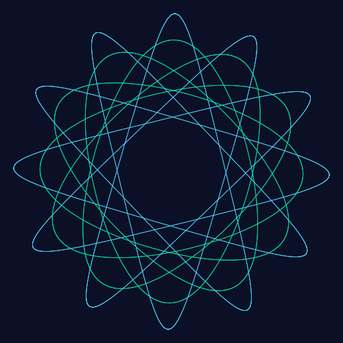

<p align="center">
  
  
</p>

<p align="center">
  
</p>

# @spirograph/cli

Spirograph pattern generation **command-line tool**: turns a URL query (or JSON) directly into **PNG / SVG** files. Built on [`@spirograph/core`](https://www.npmjs.com/package/@spirograph/core) — the exact same query engine as the web image endpoint, so a CLI result matches the browser output byte-for-byte in colors and geometry.

```bash
$ spirograph generate --params "ring=72&rolling=30&pen=40,e63946,2.5&pen=75,2,1d6fa5" --format png --size 512
✓ generated PNG → spirograph.png (71231 bytes)
```

## Install

```bash
npm install -g @spirograph/cli   # or: npx @spirograph/cli
```

## Usage

```bash
spirograph generate --params "ring=72&rolling=30&pen=40,2.5,e63946&pen=75,2,1d6fa5" --format png --size 2048 --out out.png
spirograph generate --params "ring=72&rolling=30&pen=40,2.5,10,e63946,1d6fa5,f4a261" --format svg --out out.svg
spirograph generate --json '{"ringTeeth":72,"rollingTeeth":30,"pens":[{"hole":40,"colors":["#e63946"],"width":2.5}]}' --format png
spirograph --help
```

## Options

| Option | Description |
|---|---|
| `--params <query>` | URL query (same format as web share links / image endpoints) |
| `--json <json>` | SpirographState JSON (takes precedence over `--params`) |
| `--format <fmt>` | `png` / `svg` (default `png`) |
| `--size <n>` | PNG size 64–4096 (default 1000) |
| `--out <path>` | output path (default `spirograph.<fmt>`) |

## Params

`--params` accepts the same keys as the web app / image endpoint:

| Param | Meaning | Range |
|---|---|---|
| `ring` | ring gear teeth | 40–240 |
| `rolling` | rolling gear teeth | 8–96 |
| `mode` | drawing mode | `inside` / `outside` |
| `pen` | one pen (repeatable): `hole,width,color1` solid, or `hole,width,spacing,color1[,color2…]` gradient | hole 0–100 / width 0.5–8 / spacing 1–100 |
| `bg` | background color | 6-digit hex (no `#`) |
| `size` | png size | 64–4096 |

## Development

```bash
npm run build   # tsc -b → dist/cli.js (bin: spirograph)
node dist/cli.js generate --params "ring=72&rolling=30&pen=40,2.5,e63946"
```

↳ Part of the [spirograph-generator monorepo](../../README.md). Preview what the CLI outputs at **[https://leiwan5.github.io/spirograph/](https://leiwan5.github.io/spirograph/)**.
