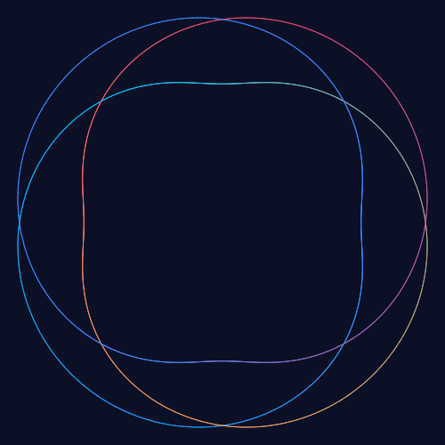

<p align="center">
  
  
  
</p>

<p align="center">
  
</p>

# @spirograph/anim

**Optional animation driver** for the spirograph: decides *how much to draw at a given progress* (frame plans) and *schedules the drawing rhythm*. It pairs with [`@spirograph/core`](https://www.npmjs.com/package/@spirograph/core) — add it only when you need the simulated "pen tracing the pattern" animation.

## What it adds (and what it deliberately doesn't)

- **No pollution of core** — all animation math lives in core's pure data operations (`buildRenderData`'s `perPenLimit` prefix truncation, `computeSteps`, `computeGearPose`). This library only handles **scheduling** and **frame plans**; it never stuffs timers / DOM into core.
- **Injectable scheduler** — browsers / RN use `requestAnimationFrame`, Node falls back to `setTimeout`; the `FrameScheduler` interface is plug-and-play.
- **Cross-platform consistency** — `createFramePlan` is a pure function; the browser canvas and a future react-native-svg consume the *same* frame plan.

## Install

```bash
npm install @spirograph/anim @spirograph/core
```

## Usage

```ts
import { createFramePlan, DrawAnimation, autoScheduler } from '@spirograph/anim';
import { buildItems, computeBounds, computeTransform, buildRenderData } from '@spirograph/core';

const items = buildItems(state);
const t = computeTransform(computeBounds(items.map(i => i.curve)), 800, 800, 32);

// Per frame: how much each pen draws at a given progress (pure function)
const plan = createFramePlan(items, 0.42, { step: true });
const data = buildRenderData(items, t, { perPenLimit: plan.perPenPoints.map(n => Math.max(0, n - 1)) });

// Drive the animation (scheduler injectable)
const anim = new DrawAnimation(
  (progress) => renderFrame(createFramePlan(items, progress, { step: true })),
  () => renderFinal(),
  15_000,          // base duration ms
  autoScheduler(), // browser/RN rAF; Node auto-falls back to timer
);
anim.setSpeed(2);
anim.start();
anim.pause(); anim.resume(); anim.stop();
```

## Schedulers

| Scheduler | Platform | Description |
|---|---|---|
| `rafScheduler()` | browser / RN | global `requestAnimationFrame` + `performance.now`; falls back to ~16ms timer without rAF |
| `timerScheduler()` | Node | setTimeout fallback (~16ms) |
| `autoScheduler()` | any | uses rAF when available, otherwise timer **(default)** |

## Build / publish

```bash
npm run build   # tsc -b → dist/
```

↳ Part of the [spirograph-generator monorepo](../../README.md).
