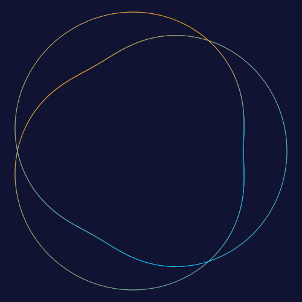

<p align="center">
  
  
  
</p>

<p align="center">
  
</p>

# @spirograph/react

React components for Spirograph — a render-only canvas and an animated, controllable canvas. They wrap the pure [`@spirograph/core`](../core) math + [`@spirograph/canvas`](../canvas) Canvas 2D glue, so patterns, gradients, and animation frames stay pixel-consistent with every other renderer.

## Install

```bash
npm i @spirograph/react
```

## Render-only canvas

Draws the finished pattern from a `SpirographState`; exposes PNG/SVG export through a ref handle.

```tsx
import { useRef } from 'react';
import { SpirographCanvas, type SpirographHandle } from '@spirograph/react';
import { DEFAULT_STATE } from '@spirograph/core';

export default function App() {
  const ref = useRef<SpirographHandle>(null);
  return (
    <div style={{ width: 480, height: 480 }}>
      <SpirographCanvas ref={ref} state={DEFAULT_STATE} />
      <button onClick={() => ref.current?.exportPng()}>PNG</button>
      <button onClick={() => ref.current?.exportSvg()}>SVG</button>
    </div>
  );
}
```

## Animated, controllable canvas

Adds a simulated drawing animation plus `play` / `pause` / `resume` / `stop` / `setSpeed` control through the ref.

```tsx
import { useRef } from 'react';
import { SpirographAnimated, type SpirographAnimationHandle } from '@spirograph/react';
import { DEFAULT_STATE } from '@spirograph/core';

export default function App() {
  const ref = useRef<SpirographAnimationHandle>(null);
  return (
    <>
      <div style={{ width: 480, height: 480 }}>
        <SpirographAnimated ref={ref} state={DEFAULT_STATE} />
      </div>
      <button onClick={() => ref.current?.play()}>Play</button>
      <button onClick={() => ref.current?.pause()}>Pause</button>
      <button onClick={() => ref.current?.stop()}>Stop</button>
    </>
  );
}
```

## Props

| Component | Prop | Type | Default | Note |
|---|---|---|---|---|
| both | `state` | `SpirographState` | — | drawing state (see `@spirograph/core`) |
| both | `className` / `style` / `id` | — | — | passed to `<canvas>` |
| `SpirographAnimated` | `playMode` | `'sequential' \| 'simultaneous'` | `'sequential'` | one pen at a time / all together |
| `SpirographAnimated` | `baseDurationMs` | `number?` | derived | explicit animation duration |
| `SpirographAnimated` | `segmentsPerSecond` | `number?` | `350` | target speed when duration is derived |
| `SpirographAnimated` | `onDone` | `() => void?` | — | fired when the animation completes |
| `SpirographAnimated` | `onPlayingChange` | `(playing) => void?` | — | fired when play state flips |

## Ref handles

| Handle | Type | Methods |
|---|---|---|
| `SpirographHandle` | render-only | `exportPng(size?, filename?)`, `exportSvg(size?, filename?)` |
| `SpirographAnimationHandle` | animated | extends render-only + `play()`, `pause()`, `resume()`, `stop()`, `setSpeed(speed)`, `onPlayingChange?` |

> **Behavior**: when `state` changes while animating, the animation stops and the static pattern is redrawn (same as the vanilla demo).

## Live demo

See `<SpirographCanvas>` / `<SpirographAnimated>` in action on the **React demo page** of the live site:

**[https://leiwan5.github.io/spirograph/react.html](https://leiwan5.github.io/spirograph/react.html)** — docs + live render-only &amp; animated examples.

## Development / demo

```bash
npm run dev        # from the monorepo root → React demo at /react.html
npm run build      # tsc -b → dist/
```

↳ Part of the [spirograph-generator monorepo](../../README.md). See also the [Svelte sibling](../svelte).
