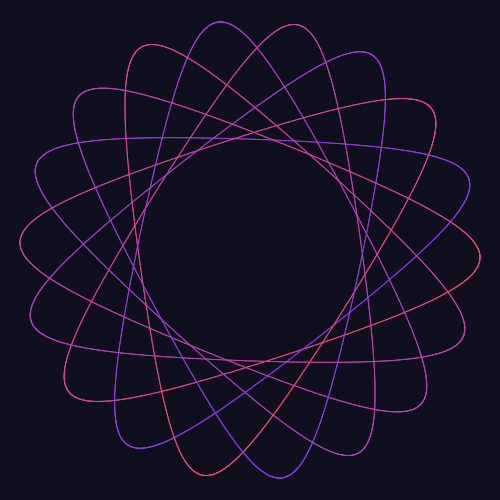

<p align="center">
  
  
  
</p>

<p align="center">
  
</p>

# @spirograph/svelte

Svelte 5 components for Spirograph — a render-only canvas and an animated, controllable canvas. They wrap the pure [`@spirograph/core`](../core) math + [`@spirograph/canvas`](../canvas) Canvas 2D glue, so patterns, gradients, and animation frames stay pixel-consistent with every other renderer.

## Install

```bash
npm i @spirograph/svelte
```

## Render-only canvas

Draws the finished pattern from a `SpirographState`; exposes PNG/SVG export through a `control` object.

```svelte
<script lang="ts">
  import { SpirographCanvas } from '@spirograph/svelte';
  import { DEFAULT_STATE } from '@spirograph/core';

  let control = {};
  function savePng() { control.exportPng?.(); }
  function saveSvg() { control.exportSvg?.(); }
</script>

<div style="width:480px;height:480px">
  <SpirographCanvas {control} state={DEFAULT_STATE} />
</div>
<button on:click={savePng}>PNG</button>
<button on:click={saveSvg}>SVG</button>
```

## Animated, controllable canvas

Adds a simulated drawing animation plus `play` / `pause` / `resume` / `stop` / `setSpeed` through the `control` object.

```svelte
<script lang="ts">
  import { SpirographAnimated } from '@spirograph/svelte';
  import { DEFAULT_STATE } from '@spirograph/core';

  let control = {};
</script>

<div style="width:480px;height:480px">
  <SpirographAnimated {control} state={DEFAULT_STATE} playMode="sequential" />
</div>
<button on:click={() => control.play?.()}>Play</button>
<button on:click={() => control.pause?.()}>Pause</button>
<button on:click={() => control.resume?.()}>Resume</button>
<button on:click={() => control.stop?.()}>Stop</button>
```

## Props

| Component | Prop | Type | Default | Note |
|---|---|---|---|---|
| both | `state` | `SpirographState` | — | drawing state (see `@spirograph/core`) |
| both | `className` / `style` / `id` | — | — | passed to `<canvas>` |
| both | `control` | `SpirographControl` | — | mutable object filled with export methods |
| `SpirographAnimated` | `playMode` | `'sequential' \| 'simultaneous'` | `'sequential'` | one pen at a time / all together |
| `SpirographAnimated` | `baseDurationMs` | `number?` | derived | explicit animation duration |
| `SpirographAnimated` | `segmentsPerSecond` | `number?` | `350` | target speed when duration is derived |
| `SpirographAnimated` | `onDone` | `() => void?` | — | fired when the animation completes |
| `SpirographAnimated` | `control` | `SpirographAnimationControl` | — | also exposes `play/pause/resume/stop/setSpeed` |

## Control objects

| Control | Methods |
|---|---|
| `SpirographControl` | `exportPng?(size?, filename?)`, `exportSvg?(size?, filename?)` |
| `SpirographAnimationControl` | extends `SpirographControl` + `play?()`, `pause?()`, `resume?()`, `stop?()`, `setSpeed?(speed)` |

> **Behavior**: when `state` changes while animating, the animation stops and the static pattern is redrawn (same as the vanilla demo).

## Live demo

See `<SpirographCanvas>` / `<SpirographAnimated>` in action on the **Svelte demo page** of the live site:

**[https://leiwan5.github.io/spirograph/svelte.html](https://leiwan5.github.io/spirograph/svelte.html)** — docs + live render-only &amp; animated examples.

## Development / demo

```bash
npm run dev        # from the monorepo root → Svelte demo at /svelte.html
npm run build      # svelte-package → dist/
```

↳ Part of the [spirograph-generator monorepo](../../README.md). See also the [React sibling](../react).
